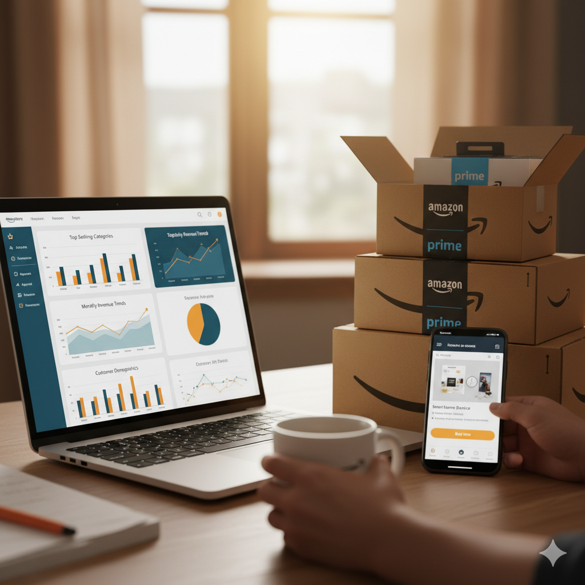

# Amazon Sales Dataset - 2023 EDA

    

## About the Author

**Syed Ahmad Rayyan**
*Young Data Science Aspirant and Kaggle Contributor*

**Contact:** [Email](mailto:rayyansyed369@gmail.com) | [LinkedIn](https://www.linkedin.com/in/syed-rayyan369) | [GitHub](https://github.com/RayyanDevZone) | [Kaggle](https://www.kaggle.com/syedahmadrayyan)

## About the Data

### Title: Amazon Sales Dataset - 2023
### Dataset Source: [Kaggle](https://www.kaggle.com/datasets/lokeshparab/amazon-products-dataset)

This dataset contains data for over 1K Amazon products across more than 140 categories, scraped from the official Amazon website in 2023. Each CSV file represents a specific product category (e.g., Shoes, Shirts, Yoga, Western Wear) and provides detailed information such as pricing, discounts, ratings, and product links.

### Features

-   **`name`**: The name or title of the product.
-   **`main_category`**: The primary category of the product (e.g., Fashion, Electronics).
-   **`sub_category`**: The specific subcategory or niche (e.g., Men's Shirts, Yoga Mats).
-   **`image`**: Direct link to the product image.
-   **`link`**: Official Amazon product page URL.
-   **`ratings`**: Average customer rating (out of 5).
-   **`no_of_ratings`**: Total number of ratings received.
-   **`discount_price`**: Current discounted selling price.
-   **`actual_price`**: Original MRP (before discount).
-   **`source_file`**: The CSV file name or category source (for traceability).

## Project Task

The goal of this project is to perform an Exploratory Data Analysis (EDA) on the Amazon Sales Dataset - 2023. This involves a comprehensive, step-by-step process:
1.  **Data Joining**: Combining fragmented datasets across various categories.
2.  **Data Cleaning and Preparation**: Ensuring data accuracy and consistency.
3.  **Descriptive Statistics**: Summarizing data using measures like averages and ranges.
4.  **Data Visualization**: Creating charts and graphs to identify patterns and relationships.
5.  **Outlier Detection**: Identifying and addressing unusual data points.
6.  **Assumption Testing**: Validating hypotheses about the data.
7.  **Data Grouping**: Segmenting data for deeper understanding.
8.  **Insight Generation**: Summarizing findings and answering key business questions.

## Objectives

The primary objective of analyzing the Amazon 2023 Product Sales Dataset is to explore category-wise pricing, discount patterns, and customer rating behavior to uncover what drives consumer engagement and purchasing decisions.

Specific objectives include:
-   Understanding the interaction between discounts, actual prices, and customer ratings across 140+ product categories to reveal trends that shape consumer trust and buying habits.
-   Identifying top-performing categories based on customer feedback, pricing competitiveness, and product value perception.
-   Translating these insights into actionable recommendations for sellers, marketers, and businesses to optimize product positioning and pricing strategies.
-   Equipping e-commerce professionals with a data-driven understanding to enhance customer satisfaction and improve conversion rates.
-   Enabling better inventory and promotional planning by highlighting categories with high engagement but low conversion potential.

## Kernel Version Used

-   Python 3.13.1

## Libraries Used

The following Python libraries were used for this analysis:
-   **Pandas**: For data manipulation and analysis.
-   **Numpy**: For numerical operations and calculations.
-   **Matplotlib**: For data visualization and plotting.
-   **Seaborn**: For enhanced data visualization and statistical graphics.
-   **Scipy**: For scientific computing and advanced mathematical operations.
-   **Glob**: Used to efficiently find all `.csv` file paths in a directory using a pattern, avoiding manual listing of 140+ file names.
-   **os**: Used to handle file paths consistently across different operating systems.

## Data Loading and Cleaning

### Data Loading
-   All 140+ individual `.csv` files from the `dataset` folder were programmatically read and concatenated into a single Pandas DataFrame using `glob` and `os` for efficient file handling.

### Initial Exploration and Cleaning
-   An initial peek at the data and its column names revealed the structure of the dataset.
-   The combined dataset consists of `1,103,170` rows and `9` columns.
-   Datatype inspection showed that all columns were initially of `object` type.
-   Significant null values were identified in `ratings`, `no_of_ratings`, `discount_price`, and `actual_price`.

### Datatype Conversion and Feature Engineering
-   **Price Columns (`discount_price`, `actual_price`)**: Removed '₹' symbols and commas, then converted to `float` type.
-   **`discount_percent`**: A new column was created to represent the discount percentage in decimal values, calculated as `(actual_price - discount_price) / actual_price`.
-   **`ratings` Column Cleaning**: Identified and removed 48 corrupted rows where the `ratings` column contained '₹' symbols.
-   **`ratings` and `no_of_ratings`**: Converted to numeric types (`float` and `Int64` respectively), coercing errors to `NaN` where non-numeric values were present.

### Handling Missing Values
-   The analysis showed:
    -   ~33.00% missing `ratings` and `no_of_ratings`.
    -   ~11.09% missing `discount_price` and `discount_percent`.
    -   ~3.23% missing `actual_price`.
-   **Conclusion on Missing Values**: The high percentage of missing ratings and discount prices were interpreted as valuable business information (unrated products, full-price items) rather than data errors, thus avoiding imputation to maintain data integrity.
-   **`actual_price` Imputation**: Missing values in `actual_price` (low percentage) were imputed using the median `actual_price` for their respective `sub_category` to minimize bias.

### Duplicate Removal
-   Identified `551,561` duplicate rows in the dataset.
-   All duplicate rows were successfully removed, resulting in a final cleaned dataset of `551,561` unique rows.

## Data Visualization

### Relationship between Price and Rating
-   A scatter plot of `Product Rating vs. Actual Price` (with a logarithmic scale on the x-axis) was used to visualize the relationship, indicating no strong linear correlation.
-   Box plots of `Actual Price` were used to identify outliers. An extreme outlier was removed to improve visualization.
-   To prevent skewness in further visualizations, a cleaned DataFrame (`df_clean`) was created where `actual_price` outliers were capped using the **Interquartile Range (IQR) method** at the upper fence value of `₹6,051.50`. This ensured that approximately 90% of products fall under `₹6,500`.

### Price Distribution
-   A histogram of the capped `actual_price` in `df_clean` confirmed that the majority of products are in the lower price ranges.

### Correlation Heatmap
-   A heatmap of numerical columns (`actual_price`, `discount_price`, `discount_percent`, `ratings`, `no_of_ratings`) in `df_clean` was generated to show the correlation between these metrics.

### Grouping and Aggregation

Several key performance indicators were aggregated by `main_category`:
-   **Product Volume**: Count of products per main category, revealing the retailer's product mix.
-   **Price Central Tendency**: Median `actual_price` per main category, providing typical price points.
-   **Performance (Average Rating)**: Average customer satisfaction per main category.
-   **Pricing Strategy Summary**: Average discount percentage, average discount amount, and median discount amount per main category.
    -   **Note**: Negative discount amounts were observed, indicating price inversion (selling price > actual price), suggesting potential data inconsistency or outdated benchmarks.

### Price vs. Rating Scatter Plot by Category
-   A scatter plot visualizing `Median Product Price vs. Average Customer Rating` for each `main_category` further explored how price and satisfaction interact across different product segments.

## Key Questions and Answers

The EDA addressed several business questions, providing data-driven conclusions:

### Q1: Which categories have the highest/lowest Average Customer Rating?
-   **Answer**: Most categories show high customer satisfaction (average ratings > 4.0). Top-rated categories achieve 4.4-4.7, while lowest-rated categories (3.5-3.8) indicate areas needing quality control.

### Q2: Which products have the highest total Volume of Ratings (`no_of_ratings`)?
-   **Answer**: Products with the highest rating volume are flagship, high-engagement items, typically from high-turnover segments like Smart Watches, Mobile Accessories, and Electronics. High review counts serve as a proxy for popularity.

### Q3: Visualize the Price Distribution: Actual Price vs. Discount Price.
-   **Answer**: The distribution plot confirms an active promotional strategy, with discounted prices consistently lower than actual prices. Promotions are concentrated in the core market segment (`₹1,000` to `₹5,000`) and heavily target budget-friendly items (< `₹1,000`).

### Q4: Which categories are most reliant on promotions (Highest Avg Discount Amount)?
-   **Answer**: Categories with the largest average discount amounts (in ₹) are generally those with higher base prices (e.g., Electronics, Large Appliances). This metric highlights where the retailer provides the greatest monetary savings. Caution is advised due to observed negative discount amounts (price inversion).

### Q5: What are the Top 5 best-selling (most frequently listed) product names?
-   **Answer**: The most frequently listed product names represent core, stable inventory and flagship products. High listing counts indicate product prominence and inventory importance, rather than direct sales volume. Top listed products are stable, high-demand items like certain gold rings and popular shirt brands.

### Q6: What is the correlation between `Discounted Price` and `Rating`?
-   **Answer**: The Pearson correlation coefficient between `Discounted Price` and `Average Rating` is very weak (0.0573). This indicates that price is not a major factor in customer satisfaction; ratings are primarily driven by non-price factors like product quality, features, and brand trust.

### Q7: Visualize the Top 5 categories by Average Rating.
-   **Answer**: The visualization clearly shows the top 5 categories clustered with average ratings between 4.5 and 4.7, setting a visual benchmark for peak customer satisfaction. This helps identify successful product lines whose strategies can be emulated.

## Conclusion

The Exploratory Data Analysis (EDA) of the Amazon Sales Dataset - 2023 successfully navigated significant data quality challenges and delivered robust, actionable insights into the retailer's pricing, inventory, and customer satisfaction landscape.

### Key Findings and Strategic Takeaways:

1.  **Data Robustness & Integrity**: Critical steps were taken to clean the data, including handling missing values, standardizing columns, and implementing Interquartile Range (IQR) capping to neutralize severe skew caused by price outliers. This established a statistically stable dataset (`df_clean`) essential for reliable analysis.

2.  **Pricing and Promotional Strategy**:
    *   The price distribution confirms strong promotional reliance, with most products sold at a clear discount.
    *   The core competitive battleground is the low-to-mid price segment (`₹1,000` to `₹5,000`), seeing the highest product volume and promotional activity.
    *   **Price Inversion**: The presence of negative discount amounts highlights data integrity issues where the current selling price is higher than the listed 'Actual Price,' suggesting outdated benchmarks or price inflation.

3.  **Customer Satisfaction and Quality**:
    *   Overall customer satisfaction is high, with most categories achieving Average Ratings above 4.0.
    *   The Price vs. Rating analysis revealed a very weak correlation (`|r| < 0.2`), indicating that customer satisfaction is overwhelmingly driven by **product quality and features**, rather than the size of the discount.
    *   Identifying the Top 5 and Bottom 5 categories by Average Rating provides clear targets for best-practice knowledge transfer and targeted quality improvement initiatives.

4.  **Inventory Focus**: Analysis of product listing counts identifies the flagship products and high-volume accessory categories central to the retailer's inventory strategy, confirming where stock and marketing efforts are heavily concentrated.

---

## Contact Info

### Syed Ahmad Rayyan - Author
### Email: rayyansyed369@gmail.com
[LinkedIn](https://www.linkedin.com/in/syed-rayyan369)
[GitHub](https://github.com/RayyanDevZone)
[Kaggle](https://www.kaggle.com/syedahmadrayyan)
